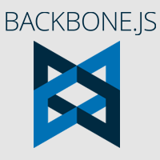

# OpenDash UI
OpenDash is some kind of Boilerplate for creating Interfaces using Backbone, Marionette, React and Redux.
It facilitates the composition and usage of often repeated MVC patterns used for developing eg. Admin UIs with HTML5.
It can be used with Bootstrap or your own alternative styling library.


&nbsp;&nbsp;&nbsp;

&nbsp;&nbsp;&nbsp;


# How to contribute
...

# Flavors
### Different style flavors
- Dasboard UI Kit (License?)
- Bootstrap

### Bundle choices
- Full - ```Backbone, Underscore, jQuery, React, Redux``` bundled inside
- Standalone - just the ``prototypes``, counting on the ```libraries needed already loaded```
