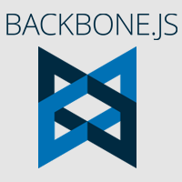

# OpenDash UI
OpenDash is some kind of Boilerplate for creating Dashboards using Backbone, Marionette, React and Redux.
It facilitates the usage of often repeated patterns used for creating Administration Interfaces and so on.

&nbsp;&nbsp;&nbsp;

&nbsp;&nbsp;&nbsp;

# How to contribute
...
